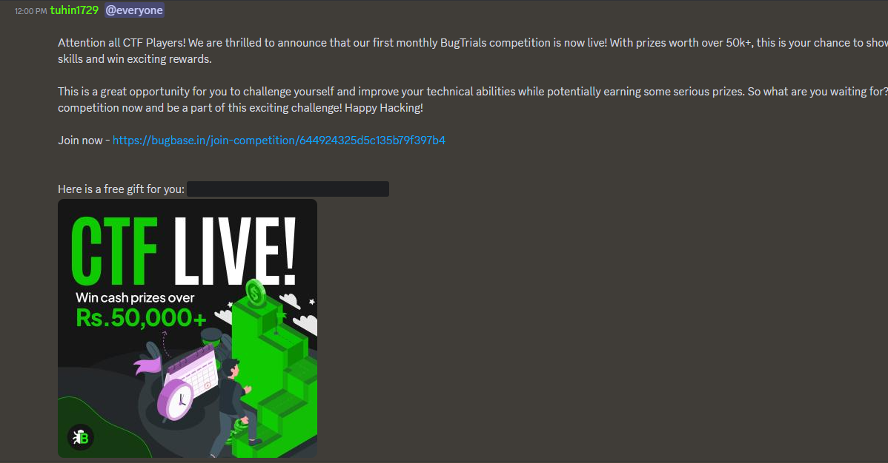

# Free Flag - 50 Points
**Description:**\
```Thanks for participating in BugTrials April. As a token of appreciation, here is a free gift for you.```

People keep on asking for flag in discord server so admin posted the flag in the Announcements channel :)

The goal of this challenge is to find the flag. Sounds easy, right? Well, it's not. The flag is located in the announcement channel, which is hidden deep inside the server. You need to have the skills of a hacker and the patience of a saint to navigate through all the channels and find the right one.



But that's not all. Once you finally reach the announcement channel, the flag is hidden behind a spoiler tag. Yes, you read that right. A spoiler tag. It's like a fortress with multiple layers of security.

To open the spoiler tag, you need to click on it. But wait, it's not that simple. You need to click on it with the precision of a brain surgeon. One wrong move and the spoiler tag won't open. You need to be calm and focused, with your eyes locked on the screen, ready to strike at the right moment.

Flag: `BugBase{w3lc0m3_70_Bug7r14ls_4pr1l}`