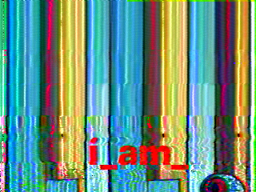
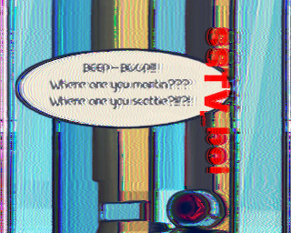
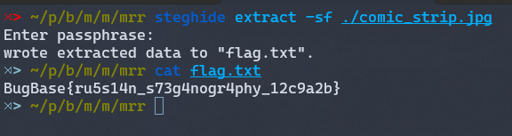

# Mr. Robot's Hide-n-Seek - 175 Points

**Description:**

You are the proud owner of Mr. Robot. A state-of-the-art multi-functional assistant robot developed by RU ROBO CORP. It can cook, it can clean, and it can even play hide and seek with humans! Unfortunately for you, the key to its control panel has been stolen. Luckily, Mr. Robot has recorded something strange while playing Hide-n-Seek with your friends Scottie and Martin, which it thinks might help you.

## Solution:

We have been provided with two files, namely `comic_strip.jpg` and `recording.wav`. The content of the jpeg image suggests that there might be a password hidden somewhere, which could potentially be used to extract a secret file using a tool such as steghide.

Upon playing the `recording.wav` file, I quickly discovered that it was encoded in `SSTV audio` format. With the help of an SSTV audio decoder application like `Robot36 - SSTV Image Decoder`, we can extract an image from the audio file. Using this application, we are able to extract three images from the audio file.

|||
|-|-|
|||
|||

We can see something written on these three images, by arranging them into a meaningful order we get `i_am_a_g00d_SSTV_boi`. Remember the jpg image? We can use this as password for steghide to get the secret files.

Flag: `BugBase{ru5s14n_s73g4nogr4phy_12c9a2b}`