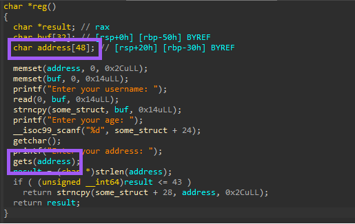
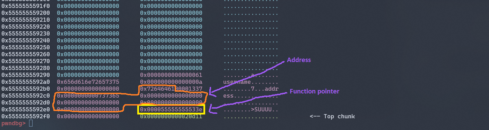
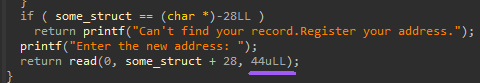
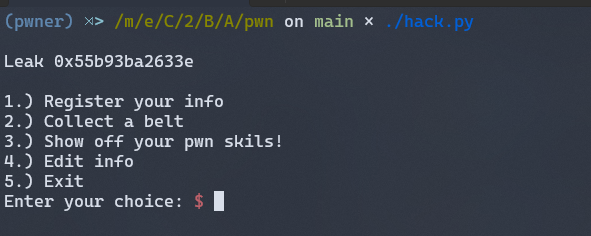
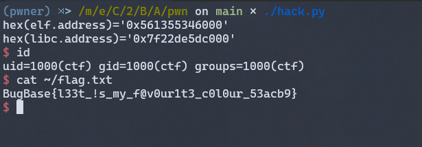

# pwndojo - 100 Points

## Challenge description
```The pwn masters have put together a Dojo for the curious ones, maybe they were inspired by pwn college but they are sending out belts for real! There are just 3 belts that they offer. But do they know that l33t is the colour for pwnsters. Have you got what it takes to claim the ... L33T Belt? nc 165.232.190.5 1337```

## Preface:

We have been given a binary file called `chall`, `libc.so.6` of the target container and a remote address `165.232.190.5:1337` to connect to. I've used a tool called `pwninit` to patch the binary to work with a specific version of libc that was provided to us.

### Checksec
```
Arch:     amd64-64-little
RELRO:    Full RELRO
Stack:    No canary found
NX:       NX enabled
PIE:      PIE enabled
```

The program has four options: `Register`, `Show belt`, `Play`, and `Edit`. You can use option 1 to register a new user, which asks for a username, age, and address, option 2 to show your belt, which displays a message indicating that you do not have a belt, option 3 to play, which triggers some actions and asks for your input and finally, option 4 to edit your user information, which allows you to change your username and address.

I'd noticed that when we use option `1` to register your information, you can overflow the buffer that is used to store your address, which means you can control the instruction pointer (RIP). This allows you to perform a Return Oriented Programming (ROP) attack, where you can chain together several instructions that are already present in the binary to perform arbitrary actions.



But we first need a PIE leak to perform ROP.

## Leak

When we select option 2 the program asks us a bunch of questions. If we answer them correctly a function pointer is stored in the memory right after the address buffer. If we fill up the address buffer we can get a PIE leak. 


There is a check in Register function which will prevent us from filling up the address buffer, but with option 4 Edit function thats not a problem.



## Exploitation
Now that we got PIE leak we can use the buffer overflow vulnerability in Register function to perform ROP. First we need libc leak, we can use the following chain to get libc address\
`puts@plt(puts@got) -> reg`

Now we can call `system('/bin/sh')` to get a shell :)




Flag: `BugBase{l33t_!s_my_f@v0ur1t3_c0l0ur_53acb9}`