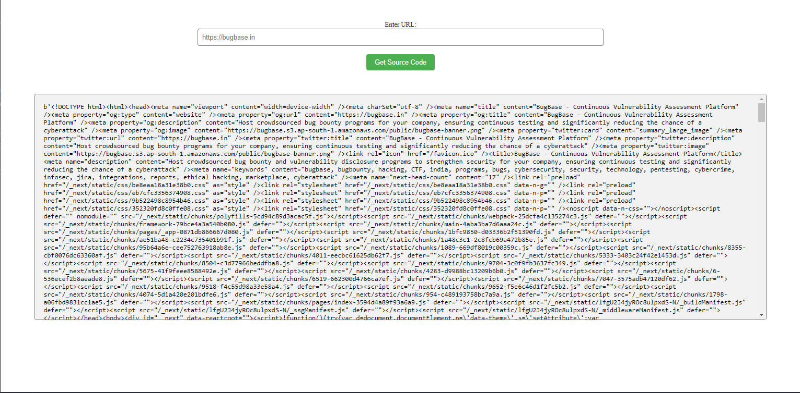
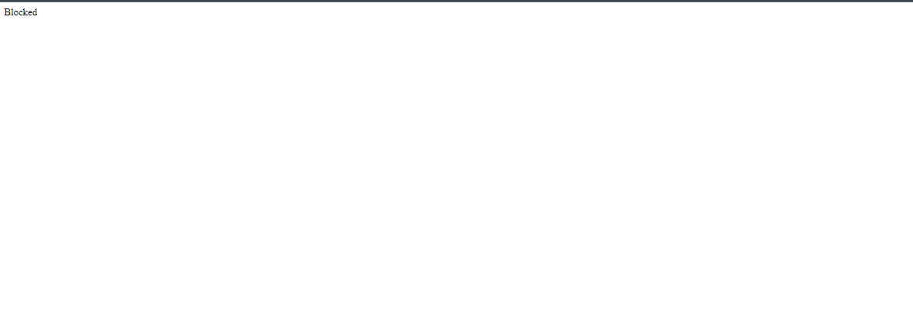
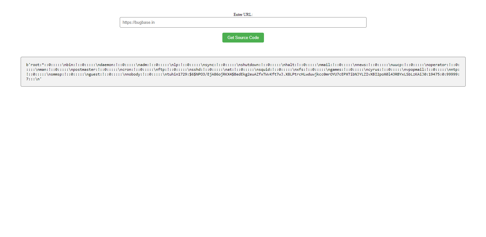

# Source Code Viewer - 100 Points

## Description:
```During one of our pentest engagement, we have found a client's web app where you can check source code of other websites. However, we're unable to exploit it further. Can you help us? P.S: As a proof of concept, the client is asking us to get the password of their employee "tuhin1729" & wrap it inside BugBase{}. For example, if the password is "1234567890", the flag will be BugBase{1234567890}```

*Link: http://165.232.190.5:8081/*

## Solution

The home page looks simple, there are only two elements on the page a form which takes a URL input and a preformated text area where the source code of the URL we pasted above is printed.



When trying to access local files using `file://` protocol we get a `Blocked` message indicating that we can't use this protocol.



Fortunately URL schemes are [case-insensitive](https://www.rfc-editor.org/rfc/rfc3986#section-3.1). Thus we can provide `FILE://` or `fiLe://`, in the end everything is translated to `file://`. With that we are successfully be able to read local files of the server.



By reading `/etc/shadow` file we can see there's a user called `tuhin` with an hash.  With the hash, we can swiftly crack it and obtain the corresponding password.

```
shunt@cloudshell:~$ john ./hash
Loaded 1 password hash (crypt, generic crypt(3) [?/64])
Will run 2 OpenMP threads
Press 'q' or Ctrl-C to abort, almost any other key for status
tiffany          (tuhin1729)
1g 0:00:00:17 100% 2/3 0.05851g/s 288.0p/s 288.0c/s 288.0C/s 1234qwer..babygirl
Use the "--show" option to display all of the cracked passwords reliably
Session completed
```

Flag: `BugBase{tiffany}`